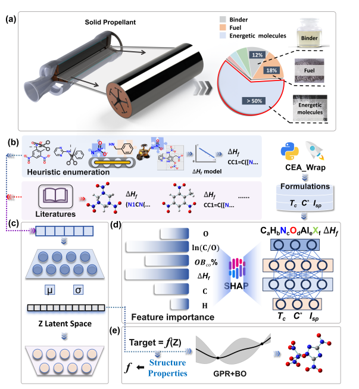

<<<<<<< HEAD
# PropellantAI-
Intelligent Energetic Molecules Design for Solid Propellants via Interpretable Machine Learning and Latent Space Optimization
=======
<<<<<<< HEAD
# PropellantAI
=======
# Intelligent Energetic Molecules Design for Solid Propellants via Interpretable Machine Learning and Latent Space Optimization

We present an AI workflow for the intelligent design of energetic molecules in solid propellants. The approach integrates property prediction, interpretability analysis, and generative modeling, supported by a diverse dataset of over 16,000 molecules. Key chemical factors such as oxygen balance and nitrogen content are identified as performance drivers, guiding the generation of novel candidate molecules. This work demonstrates a practical and interpretable pipeline to accelerate propellant formulation and energetic material discovery.
## Figure

    

Figure 1. (a) Composition of the Solid Propellant. (b) Workflow for dataset construction and domain-specific data augmentation based on rule-based molecular recombination. (c) The overall process of molecular generation using a variational autoencoder (VAE). (d) Construction of the predictive model and subsequent SHAP-based interpretability analysis to identify key structural and compositional features influencing energetic characteristics. (e) Utilizing the latent space of the pre-built generative model, Gaussian process regression (GPR) combined with Bayesian optimization (BO) is employed to generate target molecules with desired structural and property characteristics.

## Training and Test Sets
The training and test sets are derived from several sources:

- **HTPB formulation data**: Generated in `input_modify_f_ECs.pkl` (~5 million entries), with 80% used for training and 20% for testing.
- **GAP and NEPE formulation data**: Provided in `High_throughput_GAP_f_ECs.csv` (~450,000 entries) and `High_throughput_NEPE_f_ECs.csv` (~550,000 entries).

All datasets are available at [https://doi.org/10.6084/m9.figshare.29976979.v1](https://figshare.com/account/items/29976979/edit).

## Folder Structure and Descriptions

- **model_train**: Contains scripts and resources for training the property prediction models used to evaluate molecular performance.
- **model_EOF**: Dedicated to the prediction of EOF (Energetic Output Factor) values for candidate molecules.
- **Junction_tree**: Implements the JT-VAE (Junction Tree Variational Autoencoder) training and Bayesian optimization workflow.  
    - To train the JT-VAE model, first run `preprocess.py` to prepare the data, then execute `VAE-train.py`. This model is based on [jtvae](https://github.com/kamikaze0923/jtvae) with custom modifications.
    - For Bayesian optimization, navigate to the `bo` subfolder. First, run `gen_latent.py` to generate latent representations, followed by `run_gpytorch.py` to perform Gaussian process regression and optimization.
>>>>>>> 52922e1 (first commit)
>>>>>>> 27ae092 (first)
